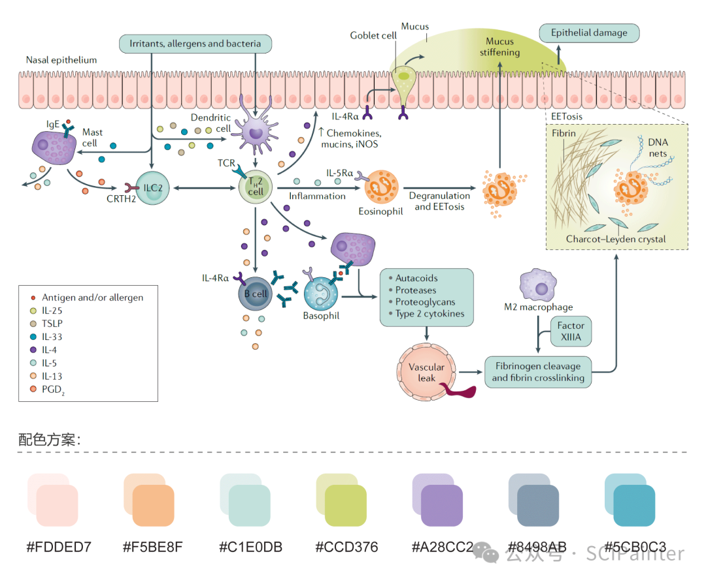
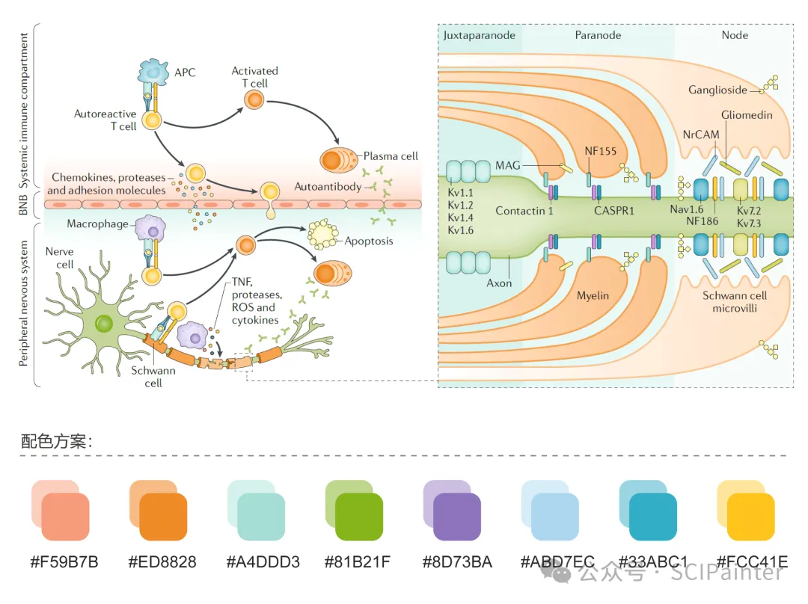
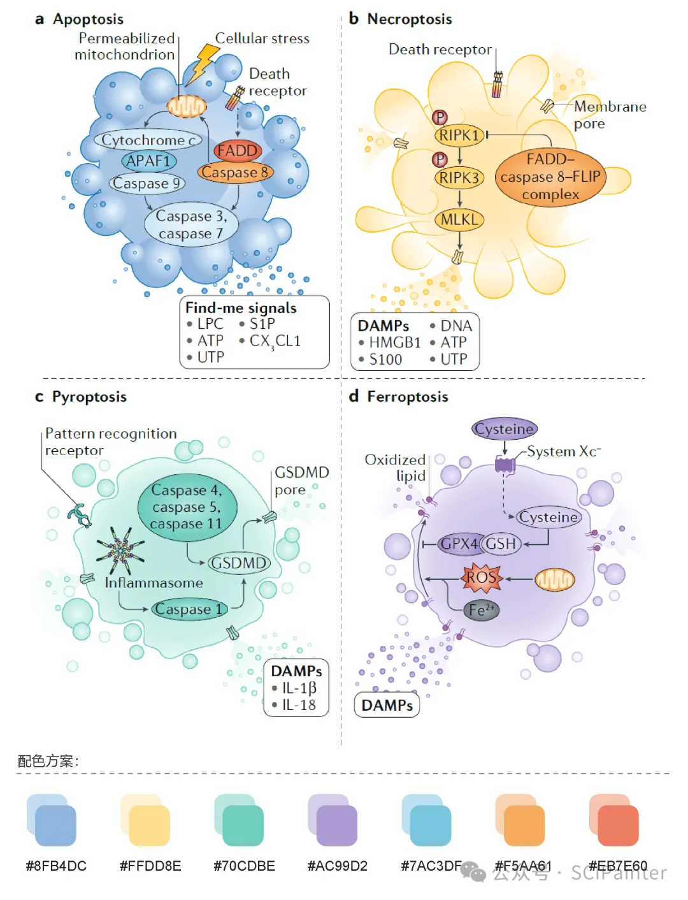
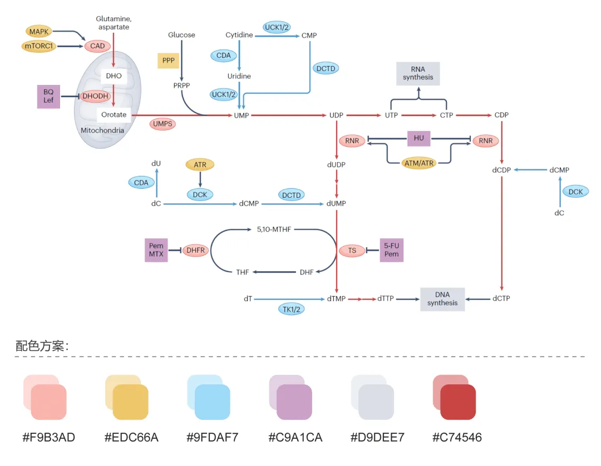
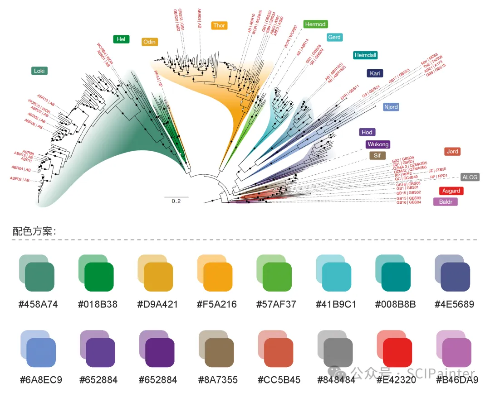
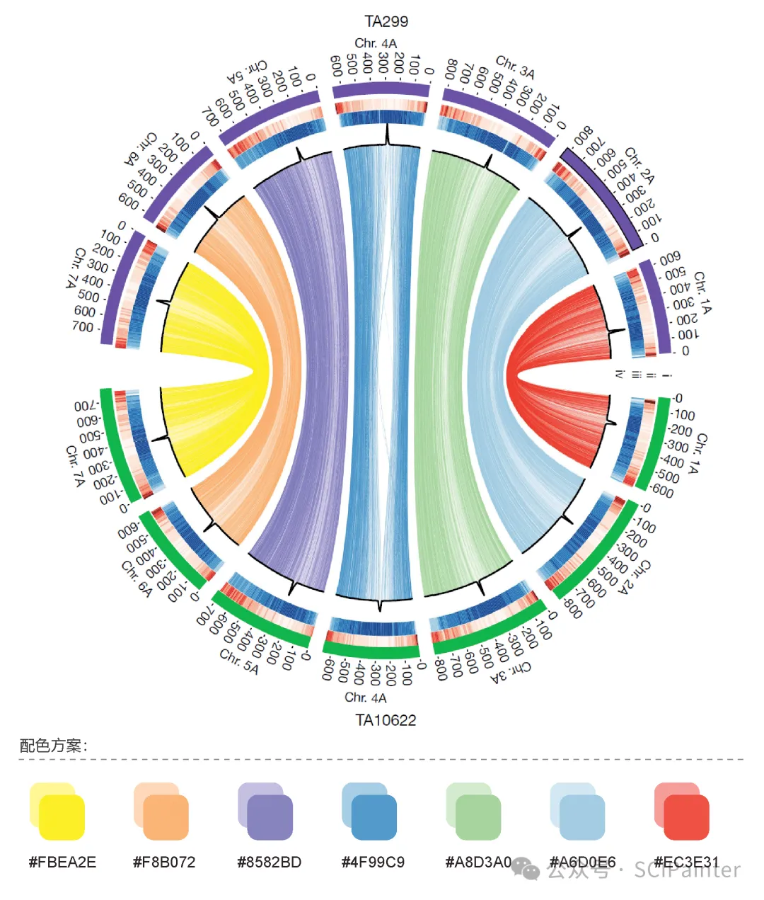

#### 1、配色方案

https://mp.weixin.qq.com/s/xIdTicrP7AfO2QbdkwGOrQ

参考文献：

1.Bachert C, Marple B, Schlosser R J, et al. Adult chronic rhinosinusitis[J]. Nature reviews Disease primers, 2020, 6(1): 86.

2.Kieseier B C, Mathey E K, Sommer C, et al. Immune-mediated neuropathies[J]. Nature reviews Disease primers, 2018, 4(1): 31.

3.Boada-Romero E, Martinez J, Heckmann B L, et al. The clearance of dead cells by efferocytosis[J]. Nature Reviews Molecular Cell Biology, 2020, 21(7): 398-414.

4.Mullen N J, Singh P K. Nucleotide metabolism: a pan-cancer metabolic dependency[J]. Nature Reviews Cancer, 2023, 23(5): 275-294.

5.Eme L, Tamarit D, Caceres E F, et al. Inference and reconstruction of the heimdallarchaeial ancestry of eukaryotes[J]. Nature, 2023, 618(7967): 992-999.

\6. Hoyt J R, Kilpatrick A M, Langwig K E. Ecology and impacts of white-nose syndrome on bats[J]. Nature Reviews Microbiology, 2021, 19(3): 196-210.

7.Ahmed H I, Heuberger M, Schoen A, et al. Einkorn genomics sheds light on history of the oldest domesticated wheat[J]. Nature, 2023, 620(7975): 830-838.

