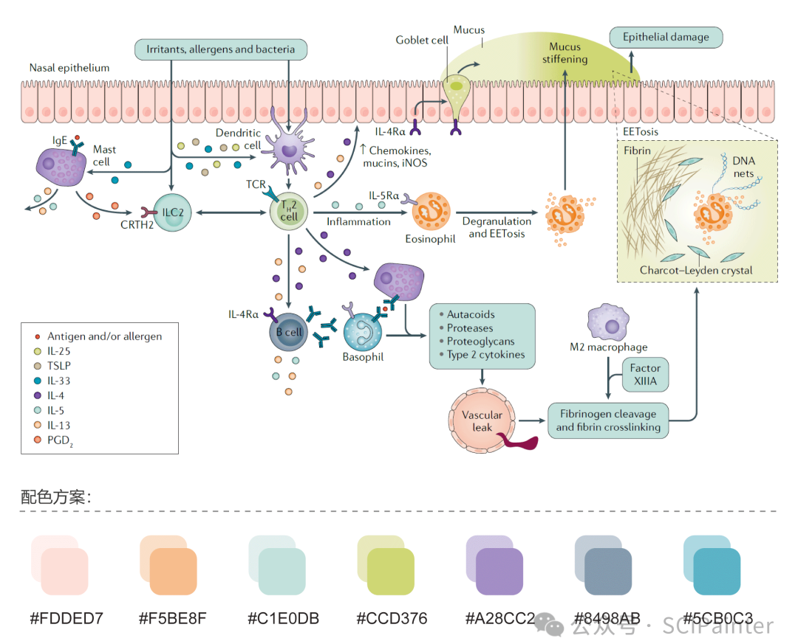
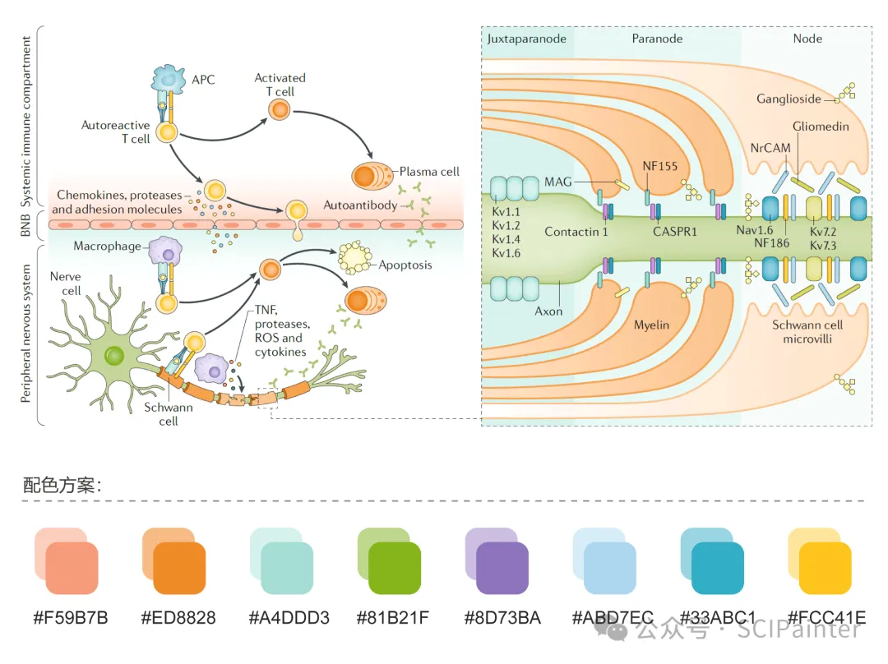
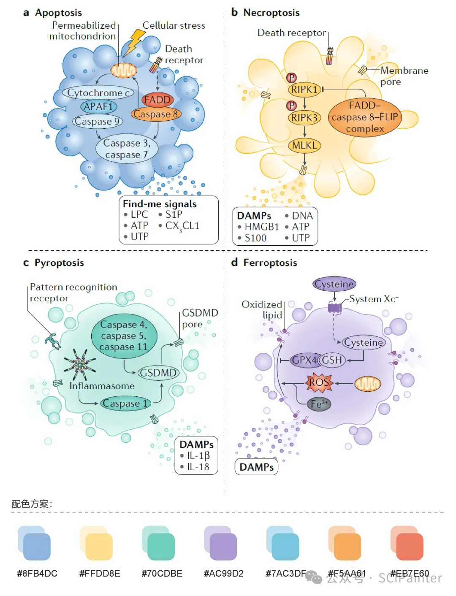
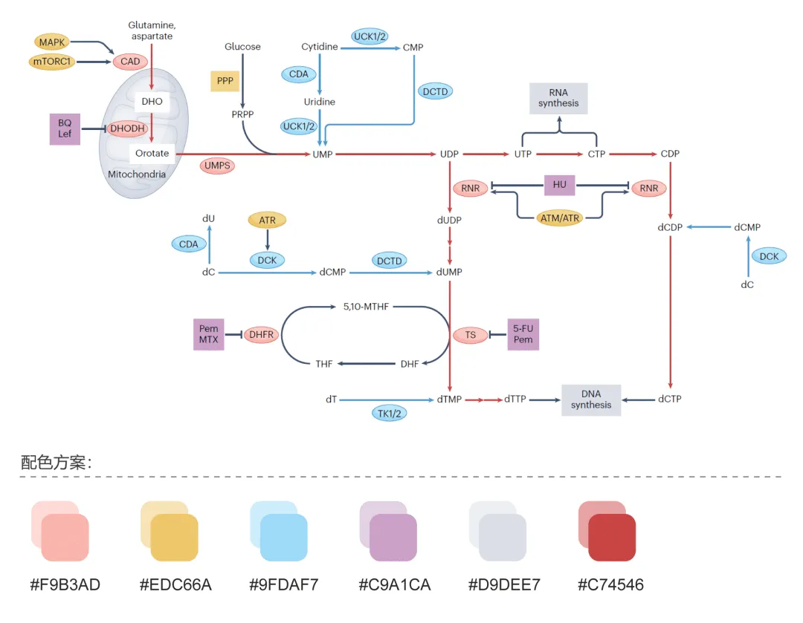
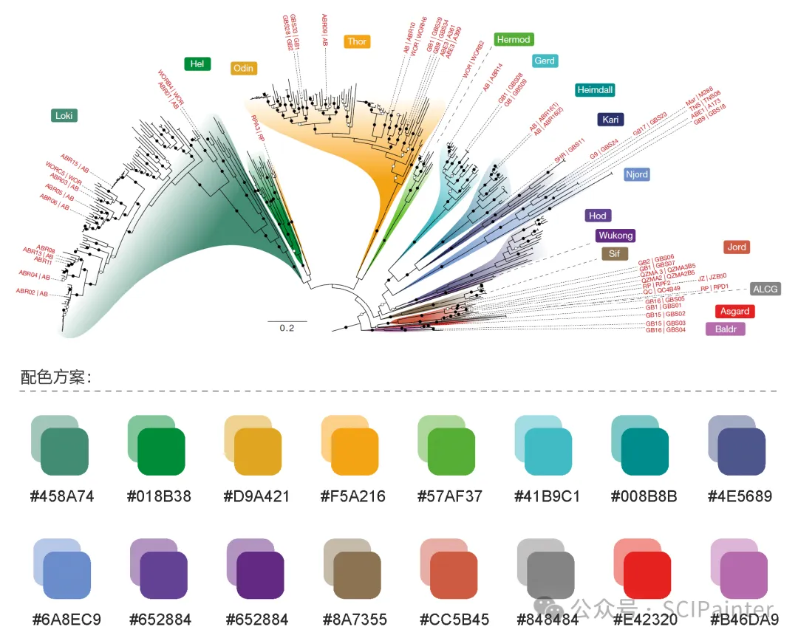
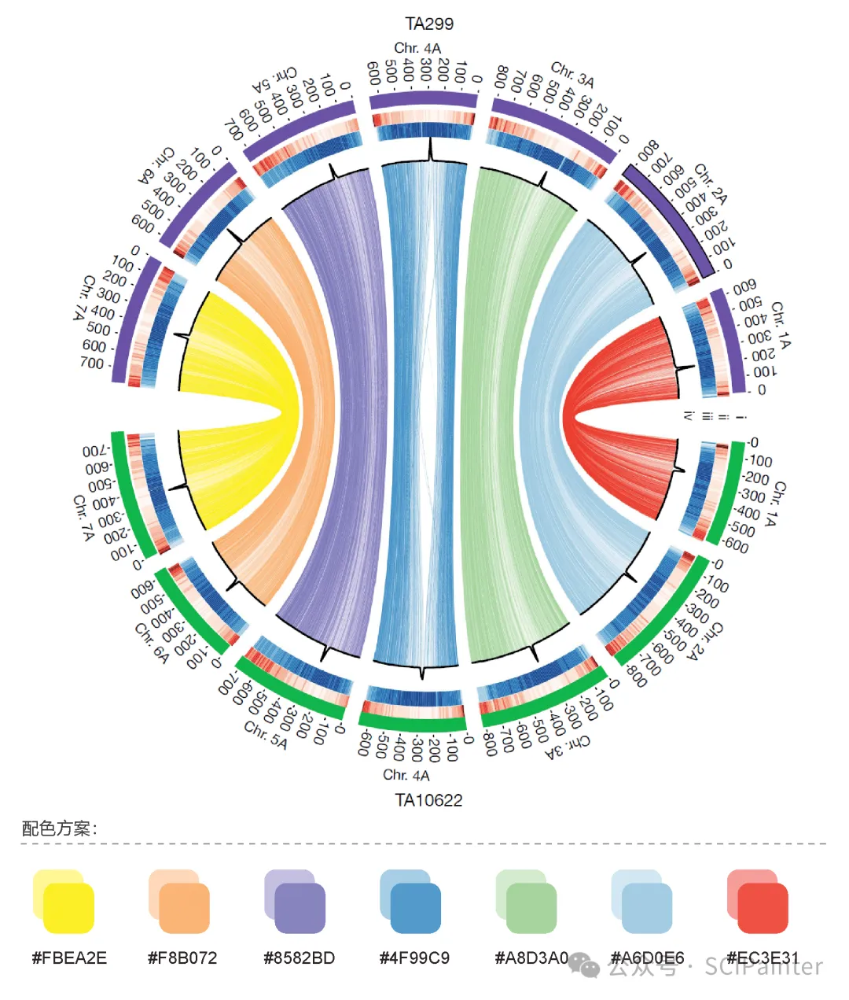

<link rel="stylesheet" type="text/css" href="../../auto-number-title.css" />

# 基础知识
## 基础概念

### 多组学

随着高通量组学平台的发展，生物医学研究大多采取了多组学技术结合的方法，不同组学来源（如遗传学、蛋白质组学和代谢组学）的数据可以通过基于机器学习（Machine Learning，ML）的预测算法进行整合，以揭示系统生物学的复杂工作

### 单细胞

#### 单细胞多组学

单细胞多组学技术和方法通过同时整合各种单模态多组学方法，对转录组、基因组、表观基因组、表转录组、蛋白质组、代谢组和其他（新兴）多组学进行剖析，从而描述细胞状态和活动

> 综述 The technological landscape and applications of single-cell multi-omics

#### 单细胞测序

> 海报论文 Single-cell sequencing

### DDI PPI DPI 问题

## 黄博提到的方向

## 研究方向

## 期刊

[EXPERT SYSTEMS WITH APPLICATIONS](https://www.letpub.com.cn/index.php?page=journalapp&view=detail&journalid=2799) 一区

[APPLIED SOFT COMPUTING](https://www.letpub.com.cn/index.php?page=journalapp&view=detail&journalid=760)

[IEEE TRANSACTIONS ON NEURAL SYSTEMS AND REHABILITATION ENGINEERING](https://www.letpub.com.cn/index.php?page=journalapp&view=detail&journalid=3408)

NAI

Nature Communications

[Nature Machine Intelligence](https://www.letpub.com.cn/index.php?page=journalapp&view=detail&journalid=11172)

|                                                              | 领域                 | IF   |
| ------------------------------------------------------------ | -------------------- | ---- |
| [Journal of Orthopaedic Translation](https://www.letpub.com.cn/index.php?page=journalapp&view=detail&journalid=10445) | 骨科                 | 6.6  |
| [BIORESOURCE TECHNOLOGY](https://www.letpub.com.cn/index.php?page=journalapp&view=detail&journalid=1196) | 生物工程与应用微生物 | 11.4 |
|                                                              |                      |      |

## 配色方案

https://mp.weixin.qq.com/s/xIdTicrP7AfO2QbdkwGOrQ

> 参考文献

1.Bachert C, Marple B, Schlosser R J, et al. Adult chronic rhinosinusitis[J]. Nature reviews Disease primers, 2020, 6(1): 86.

2.Kieseier B C, Mathey E K, Sommer C, et al. Immune-mediated neuropathies[J]. Nature reviews Disease primers, 2018, 4(1): 31.

3.Boada-Romero E, Martinez J, Heckmann B L, et al. The clearance of dead cells by efferocytosis[J]. Nature Reviews Molecular Cell Biology, 2020, 21(7): 398-414.

4.Mullen N J, Singh P K. Nucleotide metabolism: a pan-cancer metabolic dependency[J]. Nature Reviews Cancer, 2023, 23(5): 275-294.

5.Eme L, Tamarit D, Caceres E F, et al. Inference and reconstruction of the heimdallarchaeial ancestry of eukaryotes[J]. Nature, 2023, 618(7967): 992-999.

6. Hoyt J R, Kilpatrick A M, Langwig K E. Ecology and impacts of white-nose syndrome on bats[J]. Nature Reviews Microbiology, 2021, 19(3): 196-210.

7.Ahmed H I, Heuberger M, Schoen A, et al. Einkorn genomics sheds light on history of the oldest domesticated wheat[J]. Nature, 2023, 620(7975): 830-838.

